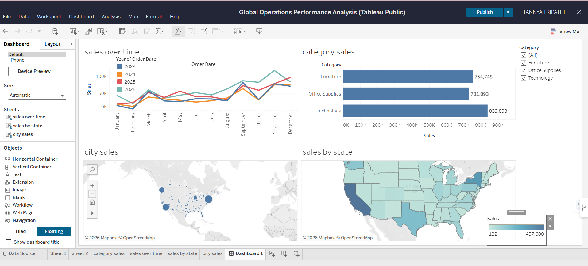

# Sales-Ops-Performance-visualization
IT Operations performance dashboard built with Tableau to track regional service sales and growth.

### 🔗 [Click Here to View Live Interactive Dashboard](https://public.tableau.com/authoring/GlobalOperationsPerformanceAnalysis/Dashboard1#1)

*Key Features:*
*Interactive Filtering:* Data can be filtered by segment and region.
*Trend Analysis:* Visualizes growth patterns over a 3-year period.
*KPI Tracking:* Monitors regional profitability to identify operational bottlenecks.
